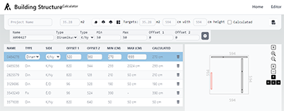

### Hi, 🐐

***I am here to***
- 🔭 learn
- 🏃 compete
- 👫 collaborate
- 💻 and work, because...

As developers, we are responsible for the future of technology. It is up to us whether we build a future for our children or conquer in the name of greed.

I choose a side long ago, based on the following quote ***"If you don't know the helpline, you are the helpline"***.

**Check my profile, and see how I can help you. 📣**

## Profile
Property                 | Data  
-------------------------|------
IDE / Tool               |       
CI / CD                  |   
Skills                   |        
Frameworks / Libraries   |              
DB                       |      
Other                    |      
Reach Me                 |      

## Work in Progress

Here is some project what i am currently developing as a hobby:

---

 

---

 

---

 

---

 

---

## My Stats

 

## Thank you

🐐💩