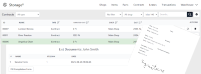
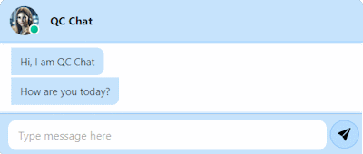

### Hi, I'm Attila 🐐

I build tools that think with you — not for you.

- 🔭 Always learning
- 🏃 Always shipping
- 🧩 Focused on modular design and long-term usability
- 💡 Believer in autonomy, clarity, and ownership in tech

> *"If you don't know the helpline, you are the helpline."*

Feel free to explore — I build with intent, and maybe for you too. 📣

## Profile
Property                 | Data  
-------------------------|------
IDE / Tool               |      
CI / CD                  |   
Skills                   |     
Frameworks / Libraries   |        
DB / Hosting             |      
Other Tools              |    
Reach Me                 |      

## Work in Progress

Here is some project what i am currently developing as a hobby:

---

 

---

 

---

 

---

 

---

 

---

 

---

 

---

## My Stats

  
 

## Thank you

🐐💩
